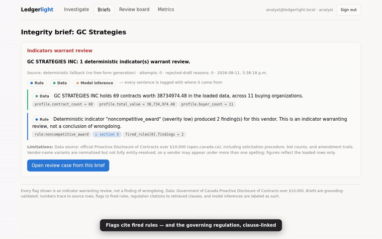
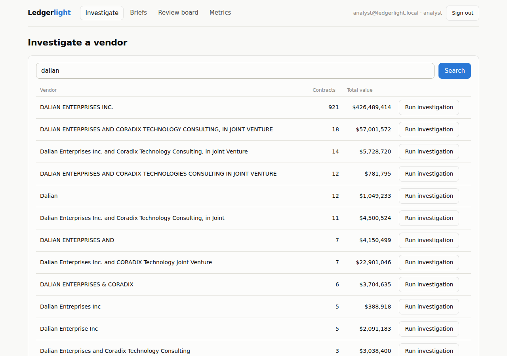
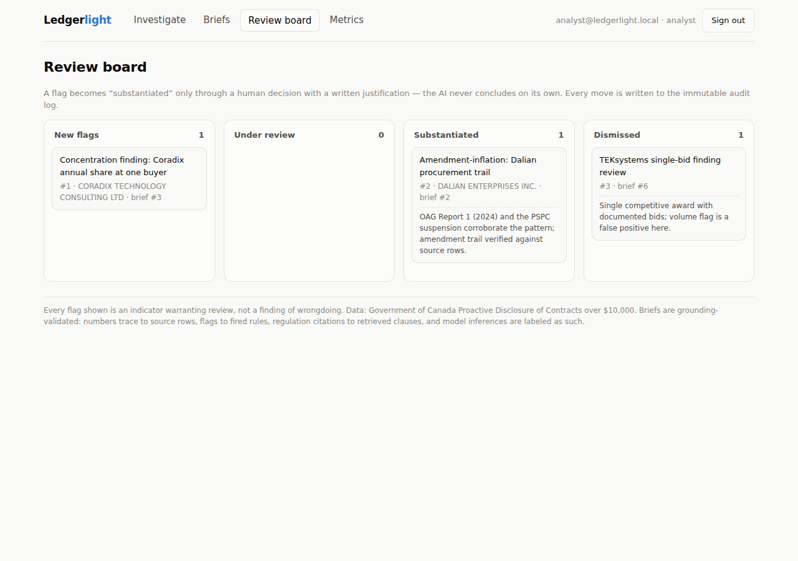
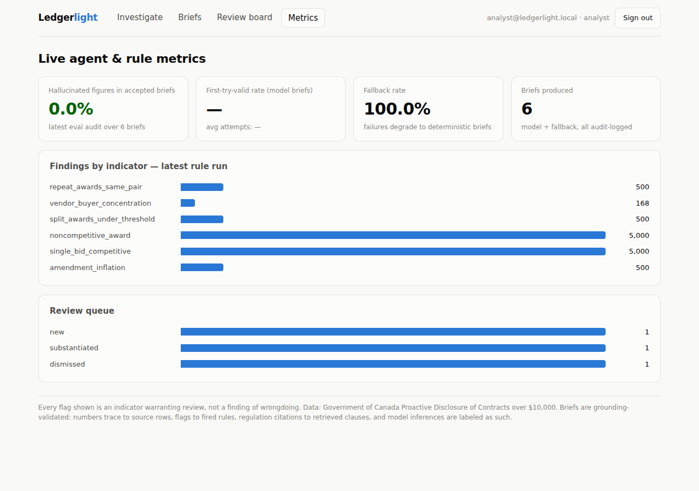
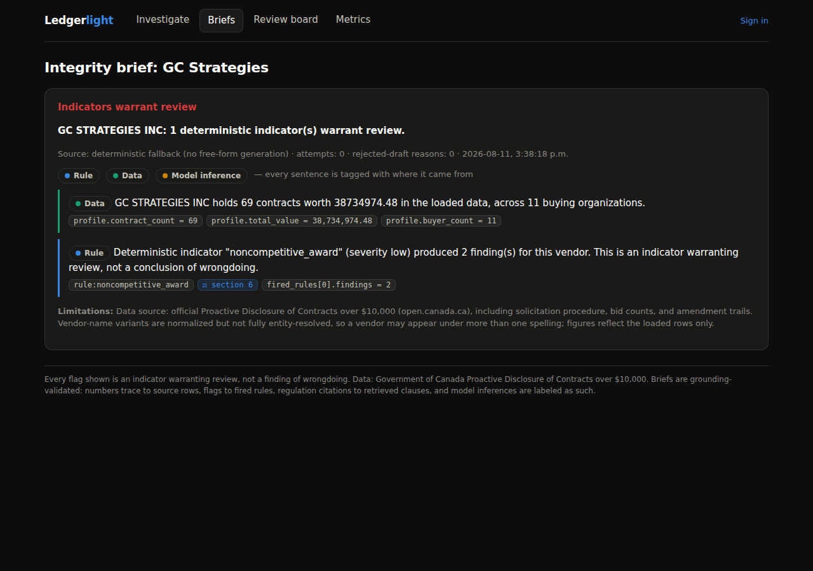

**Live project page:** [ahmedsohail2003.github.io/ledgerlight](https://ahmedsohail2003.github.io/ledgerlight/)

# Ledgerlight

**AI-assisted oversight of real Canadian public procurement — with an AI that is structurally forbidden from making things up.**

Ledgerlight loads the Government of Canada's entire [Proactive Disclosure of Contracts over $10,000](https://open.canada.ca/data/en/dataset/d8f85d91-7dec-4fd1-8055-483b77225d8b) dataset (1.31 million real contract rows), runs deterministic red-flag indicators derived from the [Open Contracting Partnership's red-flag guide](https://www.open-contracting.org/wp-content/uploads/2024/12/OCP2024-RedFlagProcurement-1.pdf) over it, and puts a grounding-validated Gemini investigator on top. Ask it about a vendor and it writes a plain-language **integrity brief** in which:

- **every number must trace to a source value** in the evidence pack — declared with a JSON path that resolves only to real evidence data, value-checked against the source (exact, with a 0.5% display-rounding tolerance; scale shorthand like "$19.1 million" passes only with the unit word present),
- **every red flag must cite an indicator that actually fired** (deterministic SQL, not vibes),
- **every citation of the law must resolve to a clause actually retrieved** from the [Government Contracts Regulations](https://laws-lois.justice.gc.ca/eng/regulations/SOR-87-402/FullText.html),
- the same numeric discipline covers the **headline and limitations**, the verdict may not contradict the fired-rule set, and everything the model merely *thinks* is visibly labeled **model inference** and may carry no figures at all.

A draft that breaks any rule is mechanically rejected and re-prompted with the exact reason; after three failures the system emits a deterministic template brief instead. That containment claim is itself under test: a **[red-team suite](docs/eval/red-team-report.md) attacks the validator with seeded hallucination briefs on every CI run** — 16 attack classes (including target-laundering and unit-scale abuse, both found by adversarial review of this codebase), all currently rejected, with the residual gaps it can't see (word-form numbers) listed in the report instead of left unsaid.

Every flag is framed as an *indicator warranting review*, never an accusation — and nothing becomes "substantiated" without a human analyst recording a written justification on the review board.

## See it working



*An integrity brief for GC Strategies, generated from the live dataset in deterministic-fallback mode (the legend's amber "model inference" tag appears on model-written sentences only — a fallback brief contains none, and says so in its provenance line). Green = stated directly from source rows, blue = derived from a fired indicator. `⚖ section 6` links to the actual regulation.*

**Full walkthrough:** [`docs/demo/ledgerlight-demo.mp4`](docs/demo/ledgerlight-demo.mp4) (31s, captioned — sign-in → vendor search → brief → review board → metrics)

| Vendor search over 1.3M contracts | Human-in-the-loop review board |
|---|---|
|  |  |
| **Live agent & rule metrics** | **Dark mode** |
|  |  |

*Screenshots and the recording are from an earlier data load; the per-indicator counts shown there were example-row counts (capped at 500/5000), which have since been replaced by complete uncapped aggregates — current numbers live in [`docs/eval/`](docs/eval/), which is regenerated on every eval run.*

## Why this exists

Canada's procurement scandals (ArriveCAN, the McKinsey contracts, Phoenix) were surfaced by auditors doing months of manual cross-referencing. The data to spot the patterns — sole-source codes, bid counts, amendment trails — is public. Ledgerlight is an exploration of what responsible AI tooling for that oversight work looks like: deterministic rules for detection, an LLM only for narration, and a validation layer that makes the LLM's failure modes structurally impossible rather than merely unlikely.

## What's inside

| Layer | Stack | The interesting part |
|---|---|---|
| Data | MySQL 8, streaming two-pass ETL (Node/TS) | Full 43-column official layout; amendments as C/A instrument rows; conservative name normalization + curated aliases |
| Rules | 6 parameterized SQL indicators | OCP-derived; non-competitive, single-bid, amendment-inflation, threshold-splitting (GCR s.6(b) ceilings), repeat-awards, concentration. Vendor flags aggregate over the **complete** result set (`rule_vendor_flags`); stored example rows are capped, the metrics never are |
| Agent | Gemini (structured output) + Zod + grounding validator | Corrective re-prompt quoting exact rejections; deterministic fallback; SELECT-only DB identity for everything the model touches — and the pool **fails closed** if that identity is missing |
| RAG | Deterministic TF-IDF over SOR/87-402 clauses | Stable chunk IDs; citations validated against the retrieved set (no legal hallucinations) |
| Eval | Gold set from OAG/OPO/parliament/suspensions | Labels independent of the rules; recall/FPR with raw counts + Wilson CIs; grounding re-audit of every stored brief; a red-team suite that attacks the validator itself in CI |
| API | Express 5, JWT/RBAC, helmet CSP, rate limits | Append-only audit log **enforced by MySQL grants** and proven by an integration test that connects as the app identity and gets denied UPDATE/DELETE |
| UI | React 19 + TypeScript + Vite | Provenance-colored briefs with clickable law citations; drag-and-drop review board with mandatory decision notes; live metrics |
| Infra | Dockerfile + Terraform (App Runner + private RDS + Secrets Manager) | AWS-ready by design; run locally today, one command to go live |

## Evaluation, honestly

The gold set labels vendors from **independent** findings — Auditor General audits (ArriveCAN, McKinsey, GC Strategies government-wide, Phoenix), Procurement Ombud reviews, PSPC suspensions, parliamentary reports — never from the rules themselves. Labels are independent, but the indicator thresholds were designed around the same public scandals, so this is an **in-sample** evaluation (no held-out set yet — the report repeats this caveat). Current results on the full official dataset (see [`docs/eval/`](docs/eval/)):

- **Rule-level recall 88.9% (8/9 problematic vendors, 95% CI 56–98%)**; false-positive rate **10.0% (2/20 sampled-clean vendors, 95% CI 3–30%)**. Small n, wide intervals, cluster-correlated cohort — screening-level evidence of signal, not calibrated performance. Sampled-clean vendors now pass the documented negative-sampling protocol (competitive footprint, ≥3 bids, normal amendment profile), and "sampled-clean" remains a weaker label than a clean audit.
- **Grounding re-audit of every stored brief: 0 hallucinated figures** — but read this precisely: the committed run's briefs are all deterministic fallbacks (the harness attempted 14 live-model investigations; the API rejected every call at the billing layer, and the system degraded exactly as designed). The fallback passing its own re-audit is a consistency check, not proof about model output. **The validator itself is what's proven adversarially**: the [red-team suite](docs/eval/red-team-report.md) rejects all 14 seeded hallucination classes in CI. A model-path eval (first-try-valid rate, attempts, rejection categories over live Gemini briefs) lands as soon as a funded API key is in place — until then this README deliberately claims nothing about live-model behavior.
- The vaccine advance-purchase agreements were planned as a **hard-negative control**, and the harness now has a documented-clean cohort wired in — but every clean-labeled gold case is program-level and links to no vendor row, so the control **has not been exercised**. The eval report states this every run rather than letting the design stand in for the result.

## Run it

```bash
# 1. MySQL (Docker) + env. First boot auto-applies the least-privilege
#    identity bootstrap (grants.sql is mounted into docker-entrypoint-initdb.d).
#    --wait blocks until the healthcheck passes, so step 2 can't race the init.
docker compose up -d --wait mysql
cp .env.example .env   # root .env IS loaded (from any workspace script);
                       # GEMINI_API_KEY optional — fallback mode without it.
                       # DB_RO_USER is required: the agent pool fails closed
                       # rather than silently running on the write identity.

# 2. Install, schema (incl. per-table grants), corpus, users
npm install
npm run migrate --workspace @ledgerlight/server
npm run rag:load --workspace @ledgerlight/server
npm run seed:users --workspace @ledgerlight/server

# (bare non-Docker MySQL instead? run the bootstrap once first:
#  mysql -u root -p -h 127.0.0.1 < server/src/db/grants.sql — needs 8.0.30+)

# 3. Data (download ~600MB official CSV, then load ~1.31M rows)
mkdir -p data/raw
curl -L -o data/raw/contracts.csv "https://open.canada.ca/data/dataset/d8f85d91-7dec-4fd1-8055-483b77225d8b/resource/fac950c0-00d5-4ec1-a4d3-9cbebf98a305/download/contracts.csv"
npm run etl:official --workspace @ledgerlight/server
npm run goldset:load --workspace @ledgerlight/server
npm run rules:run --workspace @ledgerlight/server

# 4. Evaluate, build, serve
npm run eval --workspace @ledgerlight/server          # add -- --with-llm for live model briefs
npm run eval:redteam --workspace @ledgerlight/server  # attack the validator itself
npm run build --workspace @ledgerlight/web
npm run api --workspace @ledgerlight/server   # http://localhost:8080
```

`npm test` / `npm run typecheck` in `server/`; CI runs both plus the web build, the validator red team, terraform validate, and the security gates. `LEDGERLIGHT_DB_TESTS=1 npm test` additionally proves the grant scheme against your live MySQL (UPDATE/DELETE on the audit log denied, ro identity write-denied).

## Design documents

- [`SECURITY.md`](SECURITY.md) — STRIDE model, LLM-specific threats (the grounding validator as a security boundary), OWASP Top 10 mapping, honest gap list
- [`docs/eval/red-team-report.md`](docs/eval/red-team-report.md) — the validator under attack: 14 seeded hallucination classes, plus the gaps it can't see, stated
- [`docs/research/FEASIBILITY.md`](docs/research/FEASIBILITY.md) — the gold-set research, data-quality gotchas, negative-sampling protocol
- [`infra/README.md`](infra/README.md) — AWS architecture, deploy script, cost table, and the deployment caveats stated plainly (never applied; Gemini egress needs a NAT)
- [`docs/eval/`](docs/eval/) — machine-written evaluation reports
- [`docs/demo/`](docs/demo/) and [`docs/samples/`](docs/samples/) — walkthrough recording and screenshots

## Limitations (read before quoting numbers)

Vendor names are normalized conservatively, not entity-resolved — one supplier can appear under several spellings. Amendment linkage uses `procurement_id`, which is imperfectly populated. Red-flag indicators are *screening heuristics* with documented thresholds, not findings; the OAG/OPO citations in the gold set describe those institutions' conclusions, not this tool's. The `alleged` label is used wherever no final official finding exists.

---

*Built by Ahmed Sohail Butt as an AI-assisted engineering project. The AI collaboration is part of the point: the same validate-or-reject discipline the app enforces on its own model was applied to the code the model helped write — tests, typechecks, live verification, and honest evaluation throughout.*
